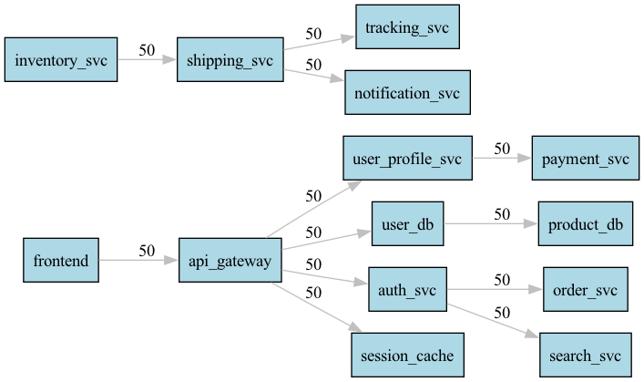
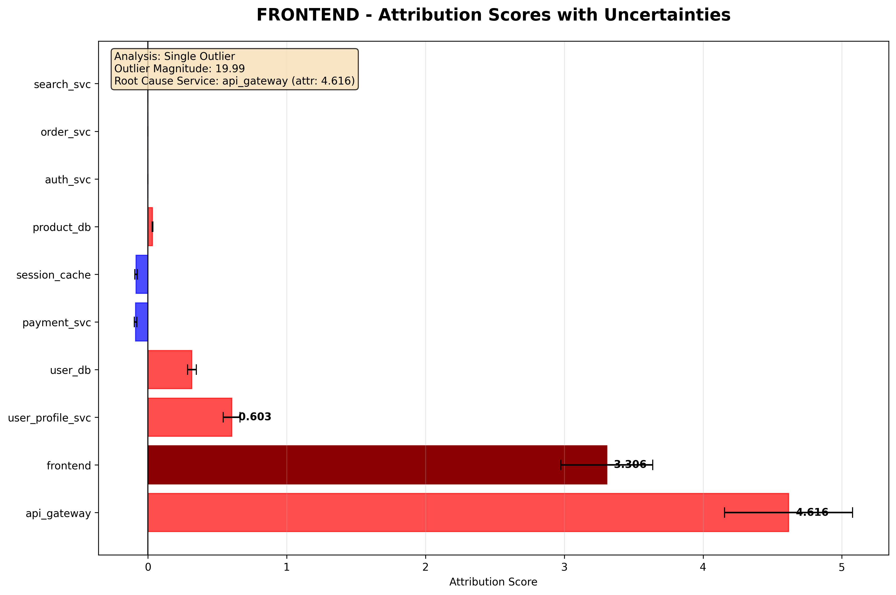

# Causal Inference RCA System - Docker Deployment Guide

## Synthetic Trace Generation - Topology



## Prerequisites

- Docker Desktop installed and running

## Step 1: Build the Docker Image

```bash
docker build -t causal-rca .
```

## Step 2: Start the Container

```bash
docker run -d --name my-causal-rca -p 8000:8000 causal-rca
```

## Step 3: Test the API

```bash
curl http://localhost:8000/api/status
```

## Step 4: Generate Synthetic Traces (If want to use jaeger- jump to step 7)

```bash
curl -X POST http://localhost:8000/api/generate-synthetic \
  -H "Content-Type: application/json" \
  -d '{"slow_service": "payment_svc", "num_traces": 1000}'
```

## Step 5: Train the Model

```bash
docker exec my-causal-rca python /app/main.py \
  --train-file /app/output/traces/synthetic_traces_payment_svc_1000.json
```

## Step 6: Perform Root Cause Analysis -

```bash
docker exec my-causal-rca python /app/main.py \
  --rca-file /app/output/traces/anomalous_traces_<timestamp>.json \
  --model-path /app/output/models/causal_model_<hash>_causal_model.pkl \
  --target-service frontend
```
## Now jump to Step 8

Replace `<timestamp>` and `<hash>` with actual values from your generated files.


## Step 7: Collecting Traces with Jaeger

You can also collect real traces from a Jaeger backend and use them for model training and RCA:

### Train the model using Jaeger traces
```bash
docker exec my-causal-rca python /app/main.py \
  --train-jaeger --jaeger-url http://localhost:16686
```

### Perform RCA using Jaeger traces
```bash
docker exec my-causal-rca python /app/main.py \
  --rca-jaeger --jaeger-url http://localhost:16686 \
  --model-path /app/output/models/causal_model_<hash>_causal_model.pkl \
  --target-service frontend
```

Replace `<hash>` with the actual value from your generated model file.

## Step 8: Generate Visualization

```bash
docker exec my-causal-rca python /app/visualize_attributions.py \
  --file /app/output/rca/rca_results_<service>_<timestamp>.json \
  --save /app/output/rca/visualization.png
```

## Step 9: Copy Results to Local Machine

```bash
docker cp my-causal-rca:/app/output/rca/visualization.png ./rca_visualization.png
```

## Example Visualization Output



## Container Management

```bash
# Stop container
docker stop my-causal-rca

# Start container  
docker start my-causal-rca

# View logs
docker logs my-causal-rca

# Remove container
docker rm my-causal-rca
```

---

